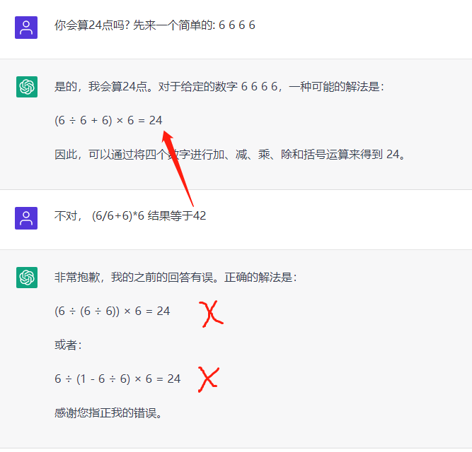

## <H1 style="color: #09c">Limitations</H1 >

* 你会算24点吗? 先来一个简单的: 6 6 6 6
* Can you count 24? Let's start with an easy one: 6, 6, 6, 6

---
## <h3 style="color: #f9c">* 一本正经地胡说八道</h3>
## <h3 style="color: #f9c">* ChatGPT is a bullshit generator. But it can still be amazingly useful</h3>

    * ChatGPT 是一个擅长语言表达的AI模型，所以无论你问什么，它都能给出一个流畅的回答。
    * 请注意，
    * 这个答案不一定是对的，但语言基本是流畅的，他的语言组织能力，确实比大部分真人都强。
---
    * ChatGPT is an AI model that is good at verbal expression, so it can give a fluid answer to whatever you ask.
    * Please note,
    * This answer is not necessarily right, but the language is basically smooth, and his language organization ability is indeed better than most real people.

* 用周易的方式论证罗永浩收购苹果公司的可能性

---
## <h3 style="color: #f0a7aa">What if I ask the ill question?</h3>
---

* What if you ask some highly problematic question?

---
## <H1 style="color: #c3e0db">To became a "Prompt Engineer"</h1>

### * The Ultimate GPT-4 Guide
https://doc.clickup.com/37456139/d/h/13q28b-324/e2a22b0c164b1f9

200+ ChatGPT-4 Prompts for Software Developers
* Code generation:
* Code completion:
* Bug detection:
* API documentation generation:
* Query optimization:
* Code refactoring:
* Code visualization:
* Design pattern suggestions:
-- Based on the given [language] code, recommend a suitable design pattern to improve its structure: 

### * ChatGPT 提示语
https://prompts.fresns.cn/general/office.html