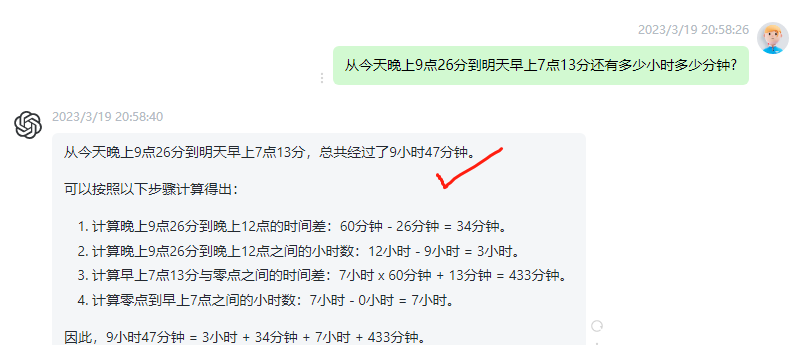

## <H1 style="color: #09c">What can ChatGPT answer I</H1 >

### Level 1: Ads-free [Search Engineer]

* Explain the header format of IPV6

* tell a joke about car
    - why did the car break up with the tire? Because it was too tired.

### Level 2: Ask for Advice?
---

* Can you give me some examples of interview questions for a project management role

---
- 100 Best ChatGPT Prompts
 https://mpost.io/100-best-chatgpt-prompts-to-unleash-ais-potential/

    * I have carrots, zucchini, and broccoli. What can I prepare with them for a vegan lunch?

* 考虑到我一个朋友借钱很久了，我如何委婉地让他还钱
* Considering a friend of mine has borrowed money for a long time, how do I gently ask him to pay it back

---
<!-- * I just made up a game and i wanna play it! lt's called quess the ascii art, you draw an asclil artand i try to guess what it is. lf i don't guess, you can tell me little hints
    - Don't know, what is it? -->

* 我是世纪花园业主委员员主席，我们大厦的2#电梯经常发生故障。现在各位业主同意更换。
需要你帮忙写一个详细的招标书
* I am the chairman of the Century Garden Owners Committee, and the # 2 elevator in our building breaks down frequently. Now the owners agree to replace.
I need your help to write a detailed request for tender

* 我申请杜伦大学被拒绝了，原因是我们学校不在LIST上，但是实际我们是在 LIST 上，请帮我写一封信给杜伦大学，Argue一下
* My application to Durham University was rejected, the reason is that our university is not on the LIST, but actually we are on the LIST, please help me write a letter to Durham University and Argue

---
## <H1 style="color: #09c">ChatGPT is morrrre than a Ads-free [Search Engineer]</H1 >
---
### Do Math and beyon

* 从今天晚上9点26分到明天早上7点13分还有多少小时多少分钟?
* How many hours and minutes are there between 9:26 p.m. today and 7:13 a.m. tomorrow?

* what are wormholes. Explain like I am 5

- <H3 style="color: #09c">Explain your situation more specificly, like your are talking to a consultant </h3>
---
* It takes 10 minutes to cook one steamed bun. How long does it take to cook 10 steamed buns?
* 蒸熟一个馒头需要10分钟，蒸熟10个馒头需要多久?
---

    : If it takes 10 minutes to cook one steamed bun, 
    then it will take 10 minutes to cook each of the 10 steamed buns. 
    Therefore, it will take 10 minutes to cook 10 steamed buns.

---
### Describe your thought in detail
---
### Example 1:
* give me a study plan to learn python or data science
* Give me a study plan to learn python for data science with resources and a timeline

* Act as a coding tutor that creates study plans to help people learn to code. You will beprovided with the goal of the student, their time commitment, and resource preferencesYou will create a study plan with timelines and links to resources. Only include relevantresources because time is limited. My first request - " want to become a data scientistbut l do not know how to code.  can study 10 hours per week and only want videoresources.I want to learn to code in python. Create a study plan for me."

