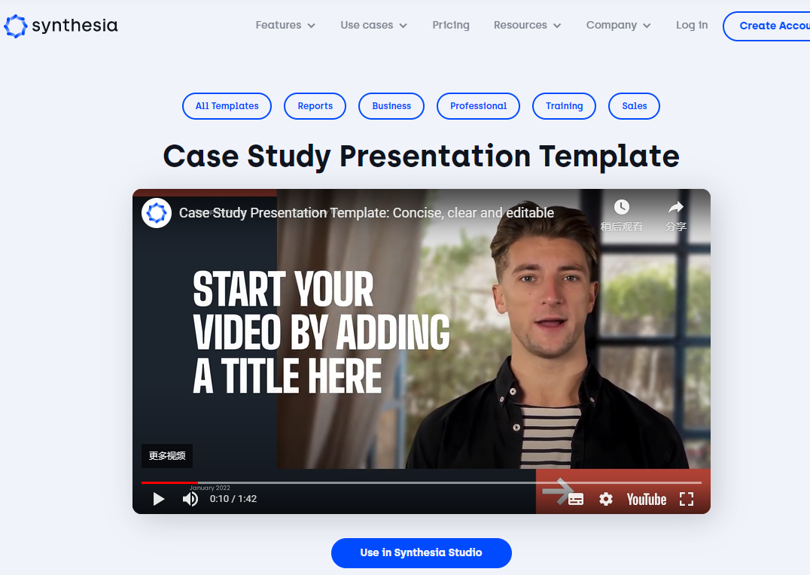

<!-- _class: lead -->

# AI-gen Web PPT

ChatPPT 命令式一键生成PPT
http://chatppt.yoo-ai.com/

# From idea to PPT

https://mindshow.fun/

## Topic: Opening a Bakery
##### Tips and Tricks for Starting Your Own Bakery

---
 ### Promt
 - A PPT about Opening a bakery. Write a headline, a teaser, a subtitle and a paragraph. Format everything in Marp markdown format. (show it in code block)

 ---
 
 ---
 
 
---

### Example 2:
* 假设你是一个专注于生产自行车的公司里的销售经理，有重要的潜在客户来拜访你的公司你需要做一个销售PPT演示，
在这个PPT里面主要包含以下几大块内容: 1，欢迎和开场白，2，公司介绍 3 公司优势 4 客户的问题和点 5 你们的解决方案和产品，
以及相对于其他竞争对手的独特优势。去让你的潜在客户对你们有一个充分的了解和信任，帮助促成你们之间的合作。
请帮我写出来这个PPT每个slide的内容结构。
* Suppose you are a sales manager in a company that specializes in manufacturing bicycles. You have an important potential customer visiting your company and you need to give a sales powerpoint presentation.
This PPT mainly contains the following parts: 1. Welcome and opening remarks; 2. Introduction of the company; 3. Advantages of the company; 4.
And unique advantages over other competitors. Let your potential customers have a full understanding of you and trust, to help promote the cooperation between you.
Please help me write out the content structure of each slide in this PPT.
Format everything in Marp markdown format. (show it in code block)
---

# AI-gen Video PPT

https://www.synthesia.io/templates/case-study-presentation
