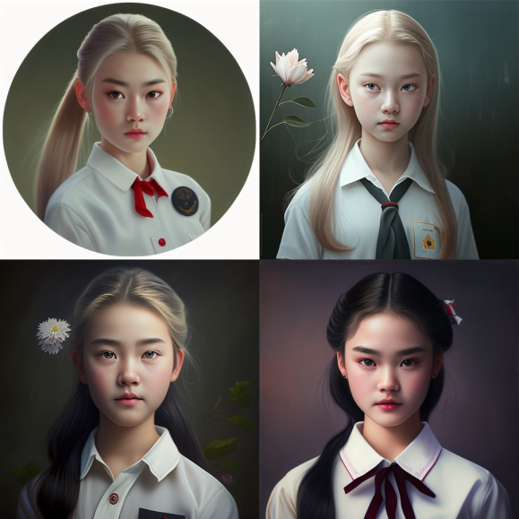

# How to promt

* Subject-driven Text-to-Image Generation via Apprenticeship Learning

<!-- * train a single SuTI model to generate novel scenes faithfully reflecting given subjects (unseen in training, specified only by 3-5 in-context text→image demonstrations), without any optimization -->

---

- 基础技能：英文！不要依靠机翻，语言机翻可能找ChatGPT可行，我还没用过，其他翻译软件不可能完全达到你的设计目的。

- 进阶技能：对美术有足够认识，比如艺术表现形式、艺术家风格之类。(Good knowledge of art, such as artistic expression form, artist style, etc)
- 高阶技能：对摄影有足够认识，比如镜头、光圈、快门、胶片的差异。(Good knowledge of photography, such as lens, aperture, shutter, film differences)

- 核心技能：对你想生成的图片有深刻洞察，全方位的细节的把关、prompt微调能力。

Midjourney现在可以按照用户的需求，模拟不同摄影设备的摄影效果，例如“shot on Canon R6 with 50mm f1.4”，此处包含了相机型号为佳能R6，50mm焦段与f1.4光圈等信息。Midjourney可以根据用户提供的信息，模拟出所需的效果。

---

     **extreme close-up **macrophotography lime green preying mantis holding a red cherry: --ar 2:3  --v 5

# Promts
- Beautiful young girl, delicate face, fair complexion, gentle, lively, cheerful, full of vitality, ponytail, light hair, clear eyes, Chinese school uniform, school flower, full-body portrait, film texture, high-definition image, outstanding photography

---

---

- An enchanted Rococo castle, by Iwona Lifsches, by teamLab

# What is Iwona Lifsches and teamLab
## Iwona_Lifsches.png

---
## teamLab

---

<!-- Picture book style illustrations,smiling japanese 3 year old girl and her cat and a 13 years old chinese boy holding a wand.

https://images.squarespace-cdn.com/content/v1/6049e33a3512a120620cfe14/1620859909443-G1Z2ADTVXW5JP6E2034T/EPAM-Logo-Edit.png

https://s.mj.run/kJxjvu4jeUQ  reimagine as delicate eyes, pastel color, fine luster, 3D render, Soft focus, oc, blender, IP, best quality, 4k

blob:https://discord.com/3f2f34fc-9562-4d08-a29b-132c21e770d8

Little girl Lily's curiosity is piqued when she finds an ancient-looking magic book in a small bookstore in her hometown. She asked the shopkeeper how the book got here, and the shopkeeper replied that he didn't know either, the book had been here for a long time. Lily became more and more interested in this book. She learned a lot of magical knowledge from the book, and what fascinated her most was the making of wands. So she set about making her own wand. She found some wood, feathers and gems, and crafted her first wand with heart. 

Rerolling http://www.jiiia.com/We03.jpg convert into cartoon, vibrint colour, full hd

Wide angle shot centered around two 60 year old nigerian men playing mancala in the outdoor market. Many people in the background shopping and talking. the market is busy with people cooking food. people in shops, having fun. many smiles. laughter. 4K --v 4 
 -->
---
## Decribe the background story for the picture
---
- 
---

- a Chinese and European multi-racial family with <u>four</u> grandparents, two parents, an uncle and a two year-old boy, taking a picture together at a gathering, looking happy and well fed, and glad to be with each other, in the style of studio ghibli and hayao miyazaki (吉卜力工作室 + 宫崎骏)

- ghibli style/summer time/a poor Chinese family of five people(young mom and dad and two older sisters and one younger brother) in a crowded room with slightly cracked walls and minimum furniture watching weather forcast from a small old tv/all black hair/super detailed/warm light --ar 7:4

---
## Image + Promt
---
- 

---
## Create images for Profit
---

---

---

## Midjourney Prompt命令 - 快速绘制大师级画作 关键字，参数
---

1.Sticker Design --- 贴纸风格

2.“A物体”As“B人物”  --- 角色替换

3.Symmetrical,flat icon design --- 简洁，对称LOGO设计

4.Game sheet --- 游戏装备列表

5.Knolling --- 将相关联的物品以平行或是 90 度排放的组织方式

6.8-bit, 16-bit  --- 怀旧游戏，像素风

7. _____made out of [material ]  --- 被材质覆盖的物体

8.Layered Paper  --- 折纸艺术画风

9.Isometric art  ---  等轴艺术画风

10.Blacklight ---  黑暗灯光特效

11.Naïve art ---  纯朴艺术画风

12.Mascot Logo --- 吉祥物设计

13. T-shirt vector --- 服装设计

14.Pattern --- 图案设计

15.Tattoo --- 纹身设计

16. Interior Design，architecture --- 建筑设计

17.Photorealistic --- 照片级真实设计

18.Stained glass window --- 被物体覆盖的窗户

19.Blender 3D --- 3D效果

20.Explode_____by Nychos -- 爆炸性街头艺术
 
---

# Resources that helps to improve Ur "Promt"

https://www.aigallery.top/

- Excel file
