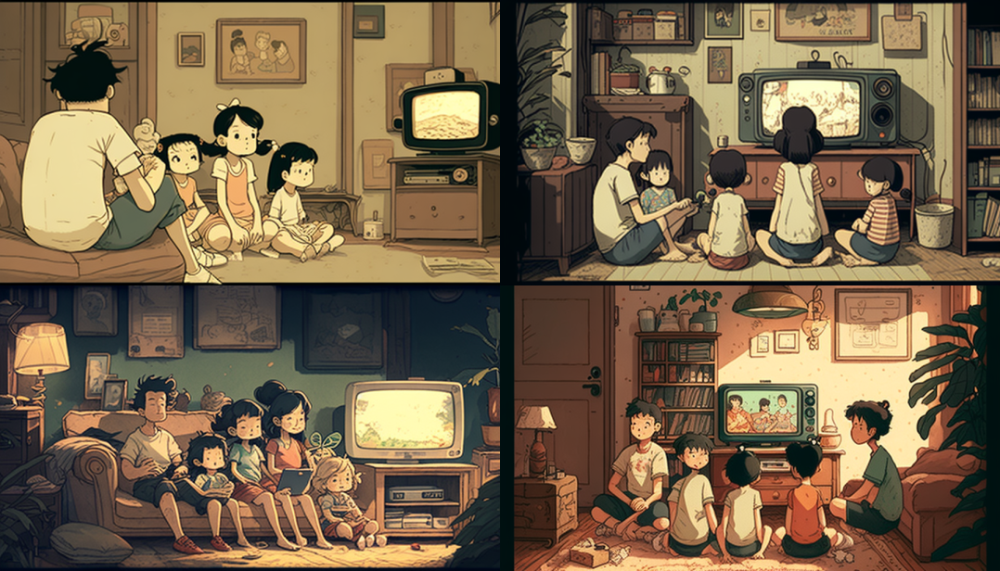

# Promts
- Beautiful young girl, delicate face, fair complexion, gentle, lively, cheerful, full of vitality, ponytail, light hair, clear eyes, Chinese school uniform, school flower, full-body portrait, film texture, high-definition image, outstanding photography

---

---

- An enchanted Rococo castle, by Iwona Lifsches, by teamLab

# What is Iwona Lifsches and teamLab
## Iwona_Lifsches.png

---
## teamLab

////////////////////////////
---

Picture book style illustrations,smiling japanese 3 year old girl and her cat and a 13 years old chinese boy holding a wand.

https://images.squarespace-cdn.com/content/v1/6049e33a3512a120620cfe14/1620859909443-G1Z2ADTVXW5JP6E2034T/EPAM-Logo-Edit.png

https://s.mj.run/kJxjvu4jeUQ  reimagine as delicate eyes, pastel color, fine luster, 3D render, Soft focus, oc, blender, IP, best quality, 4k

blob:https://discord.com/3f2f34fc-9562-4d08-a29b-132c21e770d8

Little girl Lily's curiosity is piqued when she finds an ancient-looking magic book in a small bookstore in her hometown. She asked the shopkeeper how the book got here, and the shopkeeper replied that he didn't know either, the book had been here for a long time. Lily became more and more interested in this book. She learned a lot of magical knowledge from the book, and what fascinated her most was the making of wands. So she set about making her own wand. She found some wood, feathers and gems, and crafted her first wand with heart. 

Rerolling http://www.jiiia.com/We03.jpg convert into cartoon, vibrint colour, full hd

Wide angle shot centered around two 60 year old nigerian men playing mancala in the outdoor market. Many people in the background shopping and talking. the market is busy with people cooking food. people in shops, having fun. many smiles. laughter. 4K --v 4 

漂亮的中国女孩，戴眼镜，写实，微笑

boats in the Chesapeake bay at sunset pulling up to the dock of an outdoor bar, many people having a good time

a painting of a landscape of modern villa in front of the beach, oil painting, pastel tones, beautiful ligthing, trending art station, 8k , high quality, highly detailed

https://s.mj.run/TCyK2oP4LSg convert into cartoon, vibrint colour, full hd, with clouds

http://www.jiiia.com/We07.jpg
http://www.jiiia.com/We03.jpg  

Asian man in his 30s wearing glasses as a frustrating cartoon character, sitting in a modern office setting, 
infront of a MacBook,
exuding an aura of intelligence and competence, 
digital illustration, drawn with fine lines and vibrant colors, --ar 1:1 --q 2 --s 750 

Castle in fairy tales, 4k HD, high resolution,

a panda,cute,female,Smile,very happy,Gold Branch,Cartoon,Personification,Run and jump, 4k HD, high resolution, --ar 16:9 --q 2 --s 750

A Chinese man in his 30s wearing glasses as a sad cartoon character, coding, sitting in a modern office setting, exuding an aura of intelligence and competence, 4k HD, high resolution, digital illustration

realistic old photo of ...  exceptional facial details, full body, cinematic shot, street photography, 2000, Hangzhou, negative colour film, film camera, 35mm lens

a kid on top of a ladder looking at the magical town going to sleep, vivid, night, colorful lighting, realistic

An enchanted Rococo castle, by Iwona Lifsches, by teamLab

小桥流水人家

- a Chinese and European multi-racial family with <u>four</u> grandparents, two parents, an uncle and a two year-old boy, taking a picture together at a gathering, looking happy and well fed, and glad to be with each other, in the style of studio ghibli and hayao miyazaki (吉卜力工作室 + 宫崎骏)

- ghibli style/summer time/a poor Chinese family of five people(young mom and dad and two older sisters and one younger brother) in a crowded room with slightly cracked walls and minimum furniture watching weather forcast from a small old tv/all black hair/super detailed/warm light --ar 7:4

## Midjourney Prompt命令 - 快速绘制大师级画作 关键字，参数

1.Sticker Design --- 贴纸风格
2.“A物体”As“B人物”  --- 角色替换
3.Symmetrical,flat icon design --- 简洁，对称LOGO设计
4.Game sheet --- 游戏装备列表
5.Knolling --- 将相关联的物品以平行或是 90 度排放的组织方式
6.8-bit, 16-bit  --- 怀旧游戏，像素风
7. _____made out of [material ]  --- 被材质覆盖的物体
8.Layered Paper  --- 折纸艺术画风
9.Isometric art  ---  等轴艺术画风
10.Blacklight ---  黑暗灯光特效
11.Naïve art ---  纯朴艺术画风
12.Mascot Logo --- 吉祥物设计
13. T-shirt vector --- 服装设计
14.Pattern --- 图案设计
15.Tattoo --- 纹身设计
16. Interior Design，architecture --- 建筑设计
17.Photorealistic --- 照片级真实设计
18.Stained glass window --- 被物体覆盖的窗户
19.Blender 3D --- 3D效果
20.Explode_____by Nychos -- 爆炸性街头艺术

https://www.youtube.com/watch?v=NeGShwpT-zg

sailor moon programmer IT computer girl tired
 
 

- a man happy because he just finds the way to solve a problem  

---

