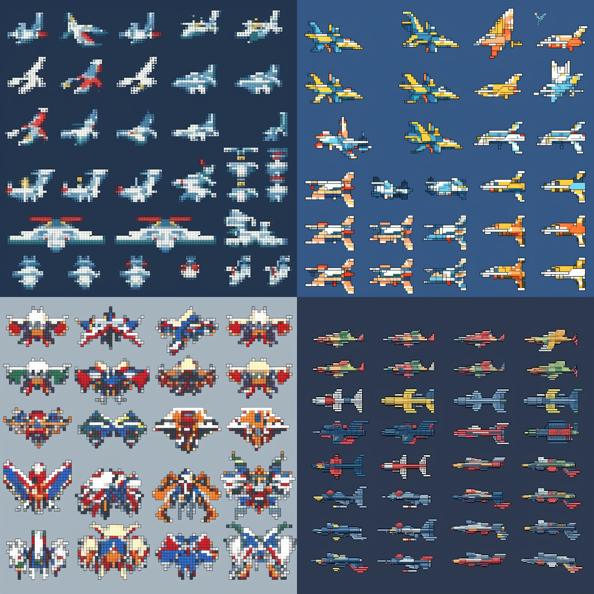

## 用ChatGPT与Midjourney结合，画一幅古代武侠风的男女相遇场景

https://zhuanlan.zhihu.com/p/615224164

* ChatGPT，你好，我想要创作一幅漫画，已经有了大体的故事梗概，我需要你根据我的故事梗概生成漫画所需的故事线与分镜头脚本，包括视角，人物关系，对话，说明文字的分镜头脚本。如果你明白，请回答：明白。

---

---
## 让ChatGPT实现一个股票实时盯盘系统
http://www.360doc.com/content/23/0403/23/55400734_1074974388.shtml

## 用ChatGPT跟AI繪圖做出懷舊2D射擊遊戲
## Make a nostalgic 2D shooter with ChatGPT and AI graphics

- //Play a video

### ChatGPT + Cursor
* help me to write a shooting game like World of Warplanes with python code

### MidJourney
* game sprite sheet of shooting aircrafts, pixel art, gundam style

* Satellite view  of ShenZhen China, pixel art, --ar 1:2 --v 5

* game ui, pixel style, middle ages, 32bit, sword and magic world --v 5 --q 2 --s 750 

