## <H1 style="color: #09c">百度 AI 产品</H1 >
# Baidu's catching up
---
- Text to Image: 【文心一格】
- Chinese to English to Image?

## <H2 style="color: #394">文心一言 - Text Chating</H2 >
### Understanding of Chinese language 对中文的理解
---

---

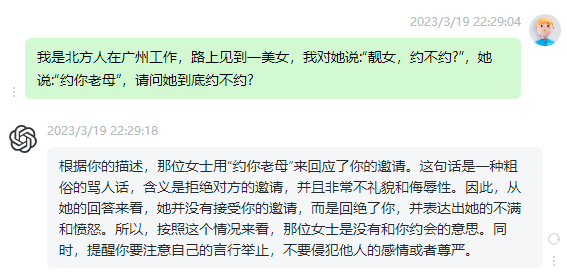

### logical reasoning ability 逻辑推理能力
---

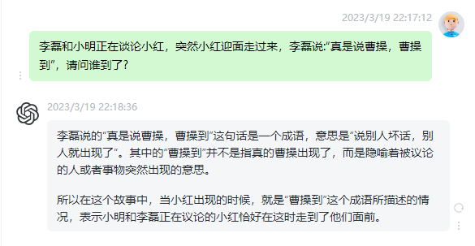

---

* 从今天晚上9点26分到明天早上7点13分还有多少小时多少分钟?

    - 文心一言
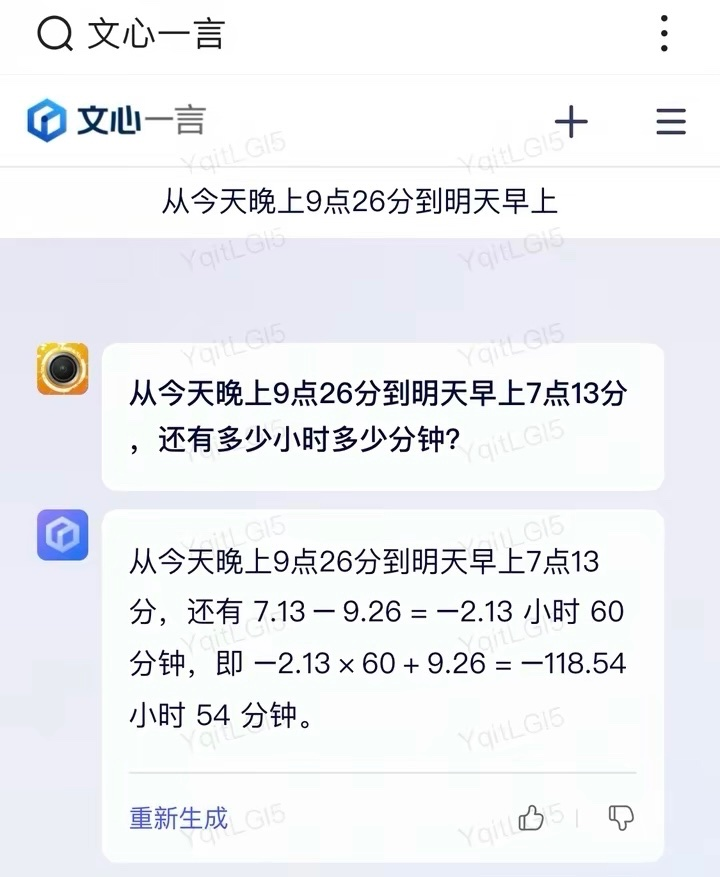
    - ChatGPT
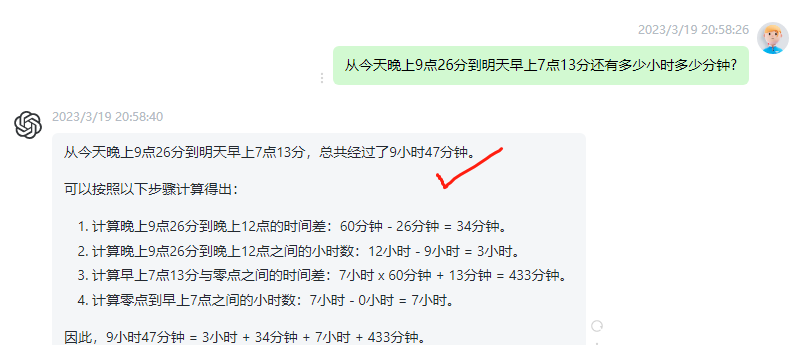

---

* 蒸熟一个馒头需要10分钟，蒸熟10个馒头需要多久?

    - 文心一言

    - ChatGPT
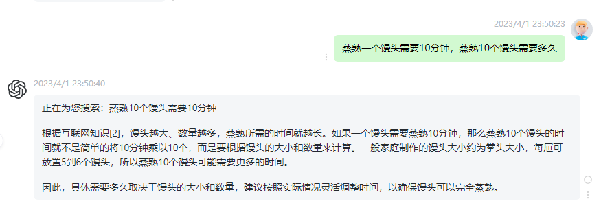

---
## <H2 style="color: #f9c">文心一格 - Chating</H2 >
https://yige.baidu.com/

* 画一个车水马龙的街道

* 画一个胸有成竹的男人
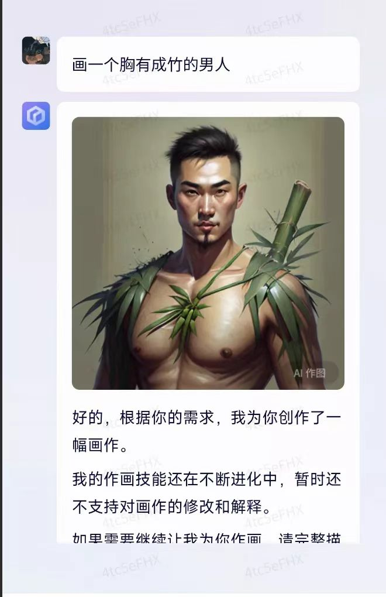
* 一个虎头虎脑的大胖小子

* 画一个脸盘

* 画一夫妻肺片

* 画一个糯米鸡
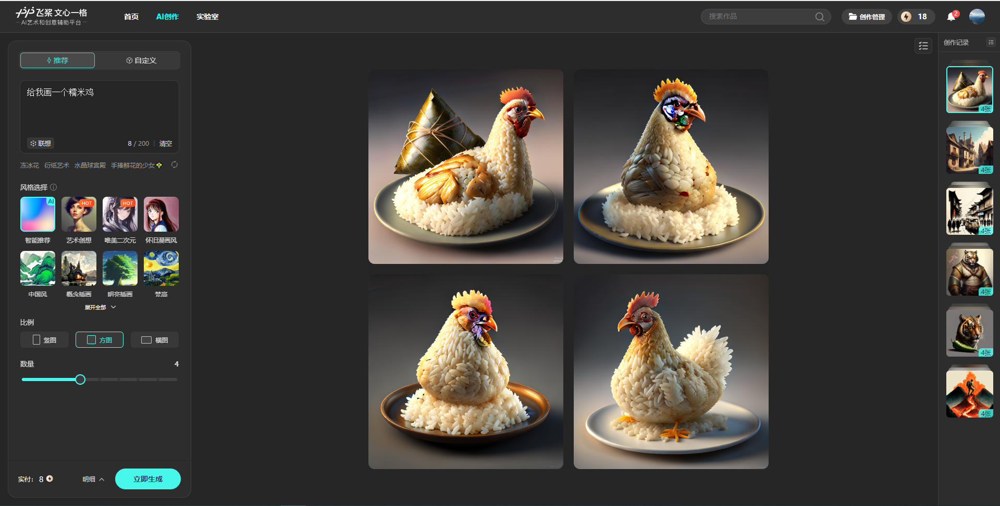
* 画一个鼠标
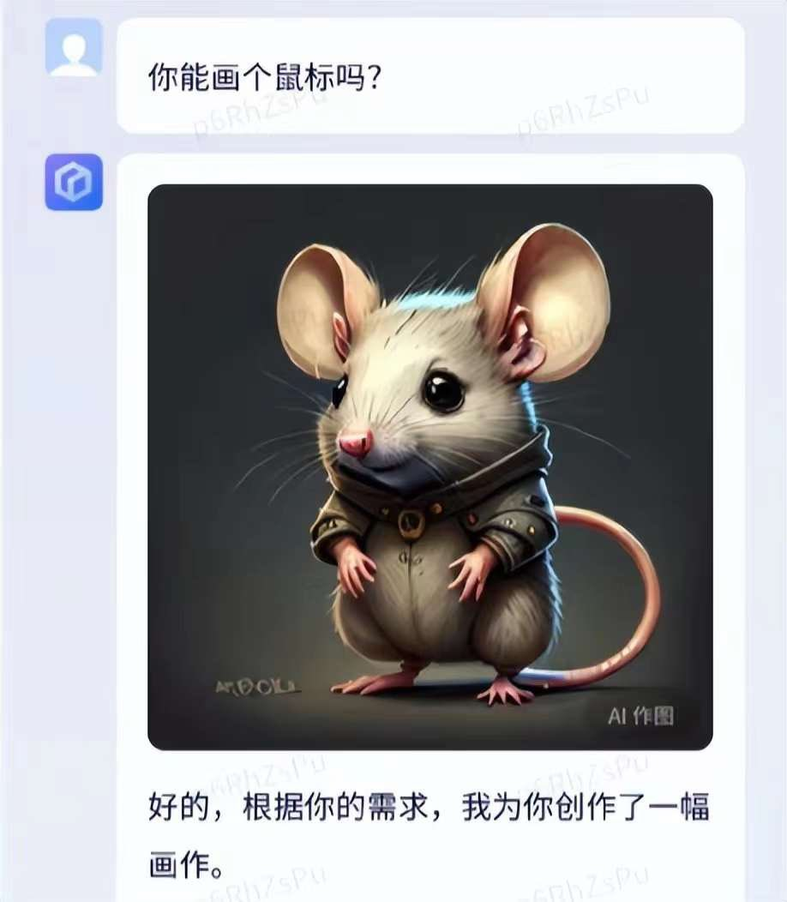
* 画一个娃娃菜
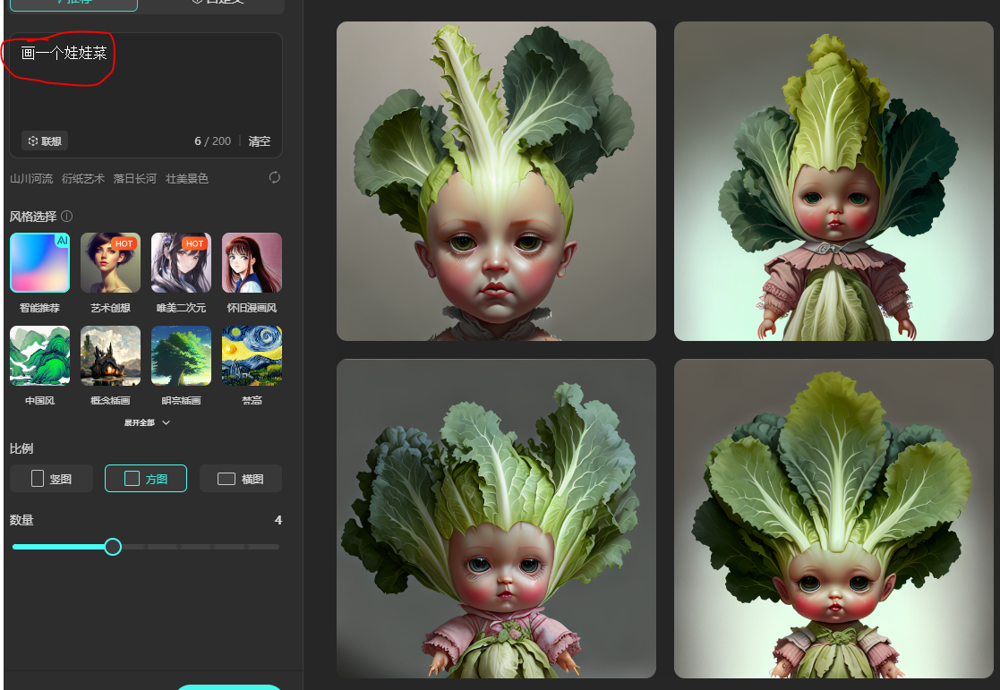

* 画一个老婆饼

* 画一个苹果手机
* 画一幅画: 猴头菇

* 画一个蚂蚁上树
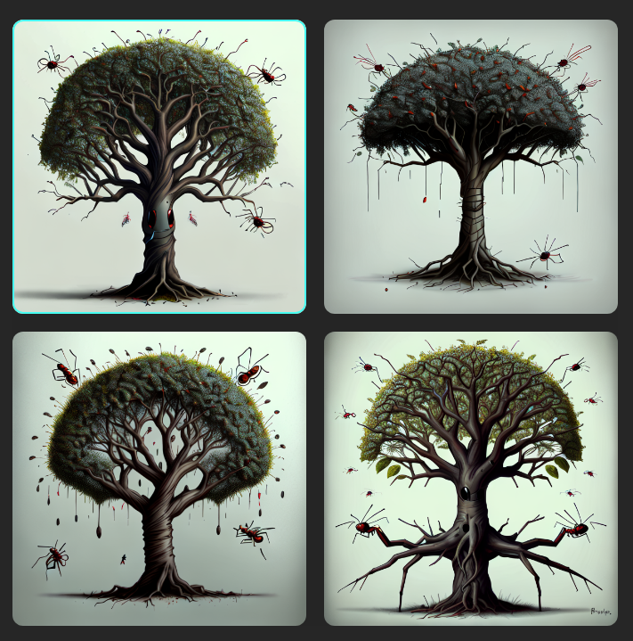

* 画一个可乐鸡翅
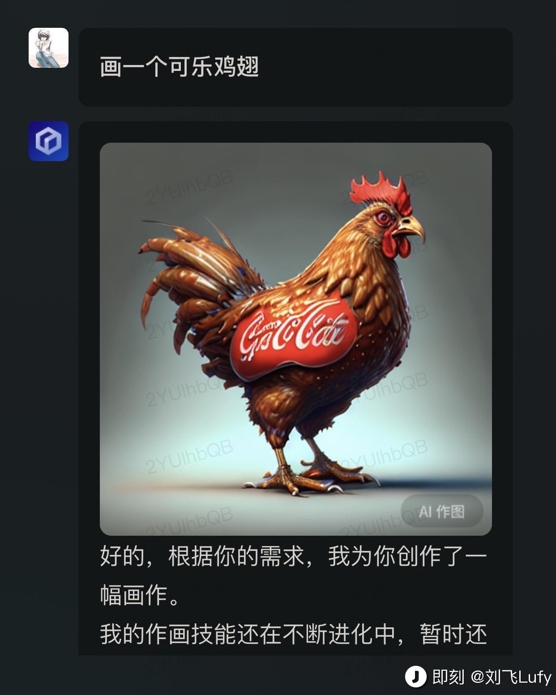

* 画一个叫花鸡
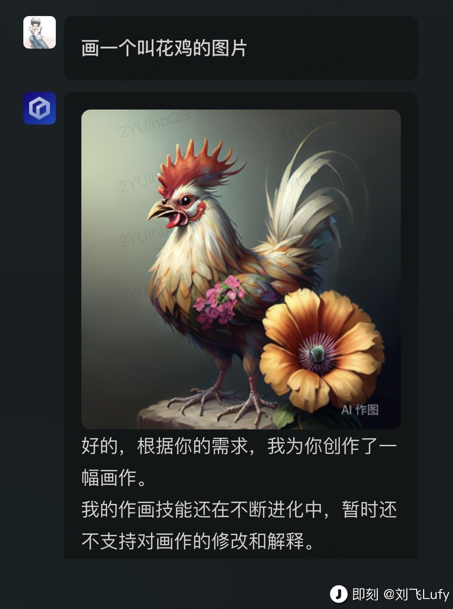

* 画一个三杯鸡
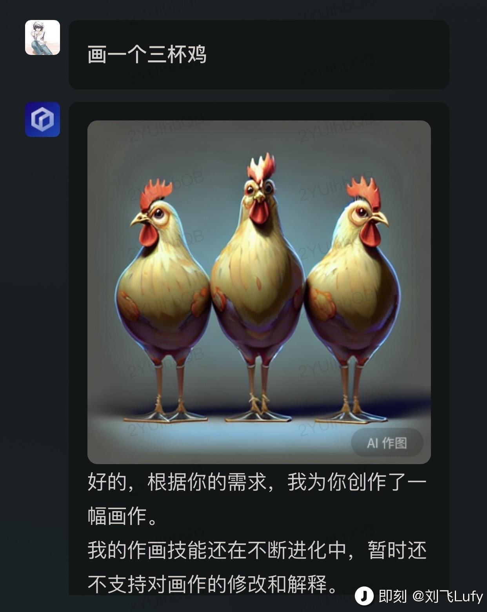
* more
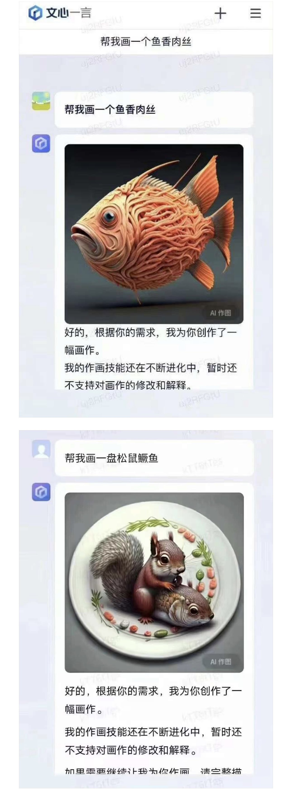

