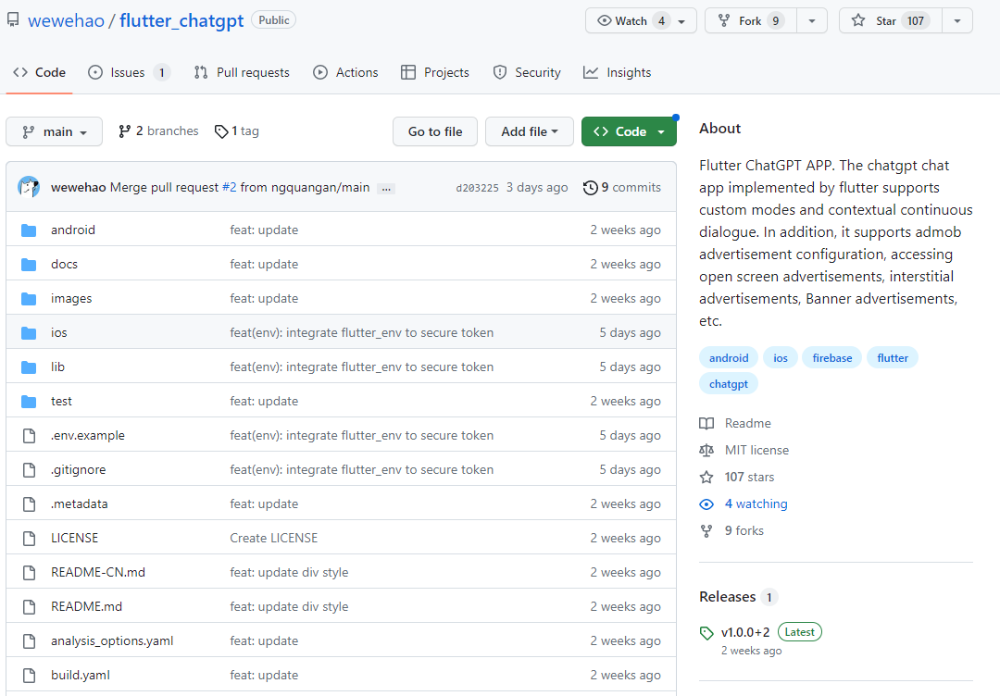
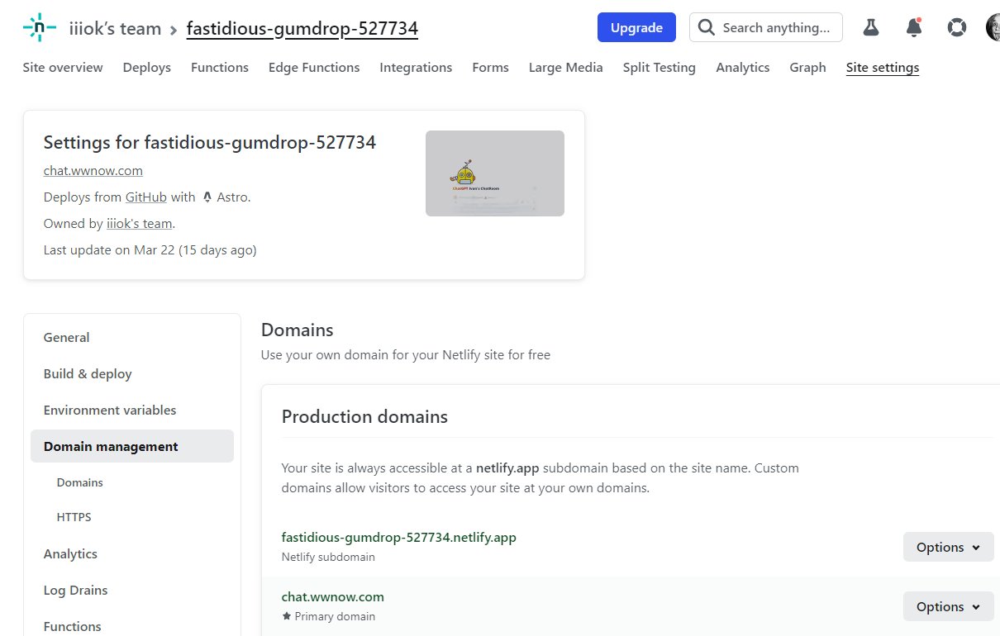

# Apply a ChatGPT account

* https://chat.openai.com/
* foreign IP
* foreign Mobil phone to recieve SMS

### Generate a API key

---

# Build ChatGPT App in various tech stacks

- Build ChatGPT App in Flutter
---

https://www.youtube.com/watch?v=BB59SwaQjrQ

https://github.com/wewehao/flutter_chatgpt

---

- Python
    -    https://github.com/search?q=Python+ChatGPT

---
- Deply a ChatGPT WebApp of Ur own

    - Code（NodeJS） ==> https://github.com/iiiok/ChatGPT_Netlify/blob/main/.env
    - Deploy ==> netlify 
https://app.netlify.com/sites/fastidious-gumdrop-527734/overview
---

- 

- https://chat.wwnow.com/