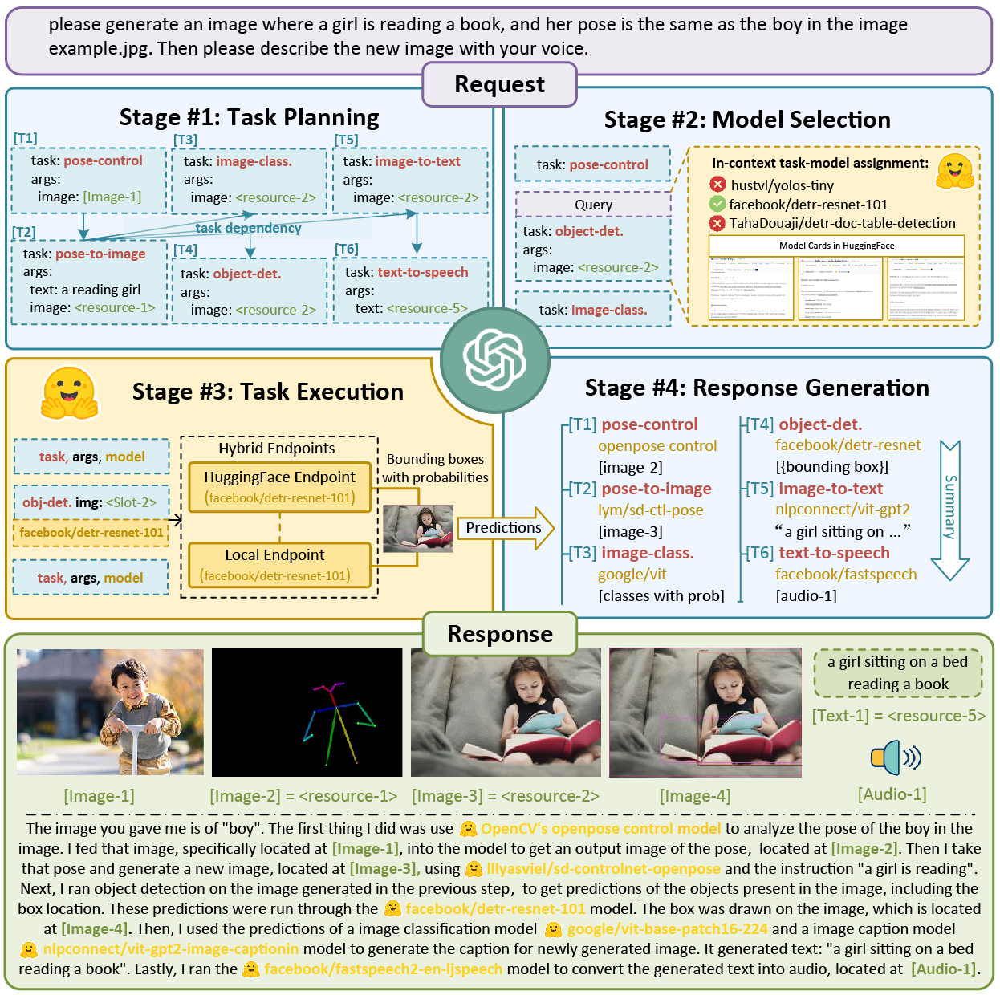
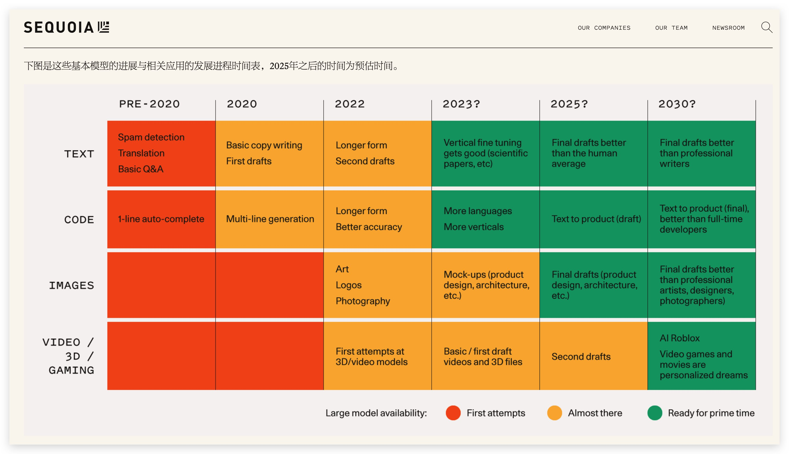
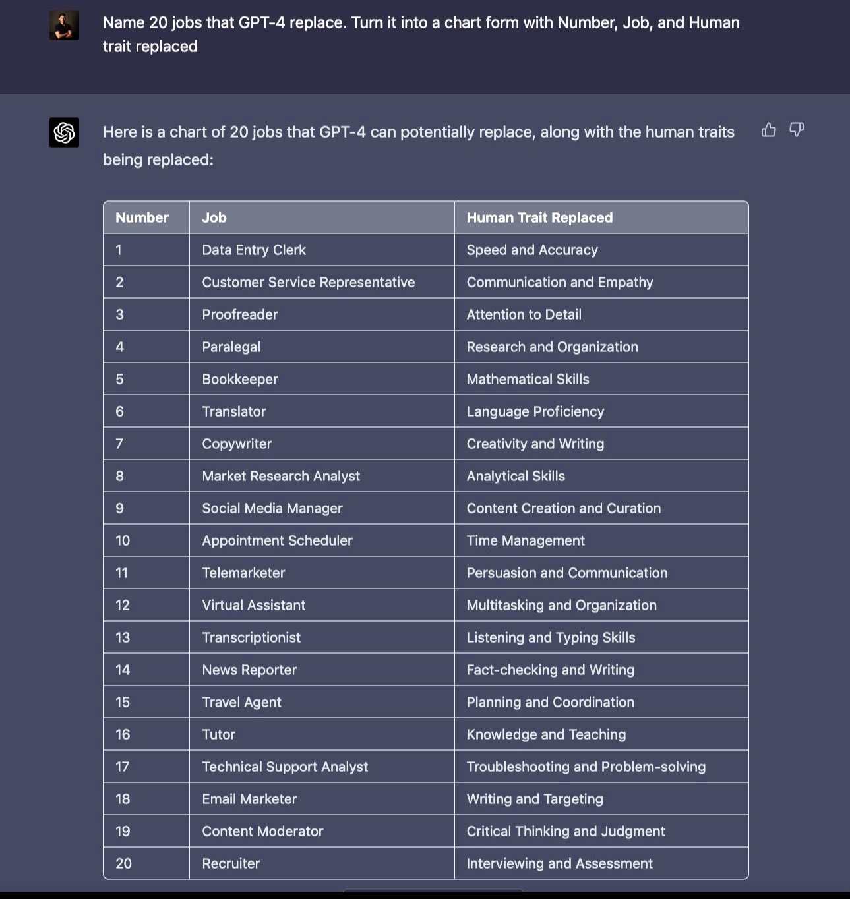
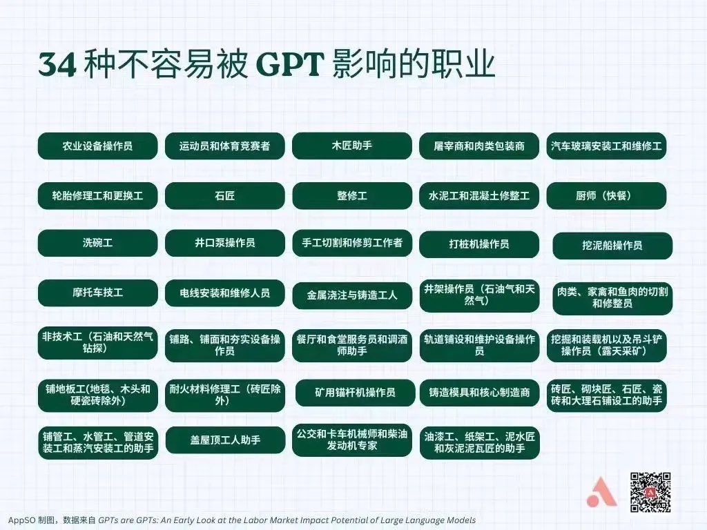
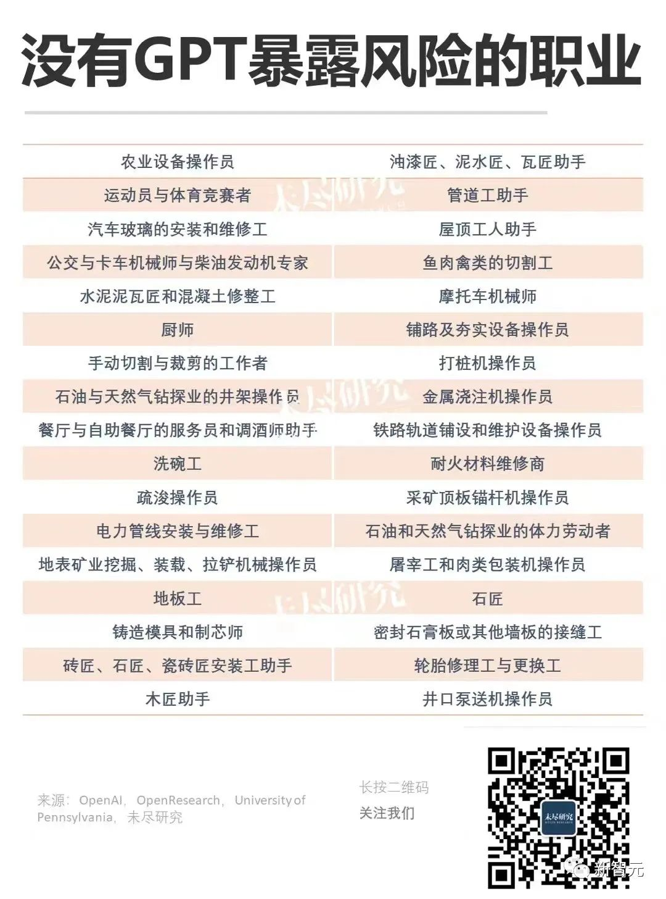
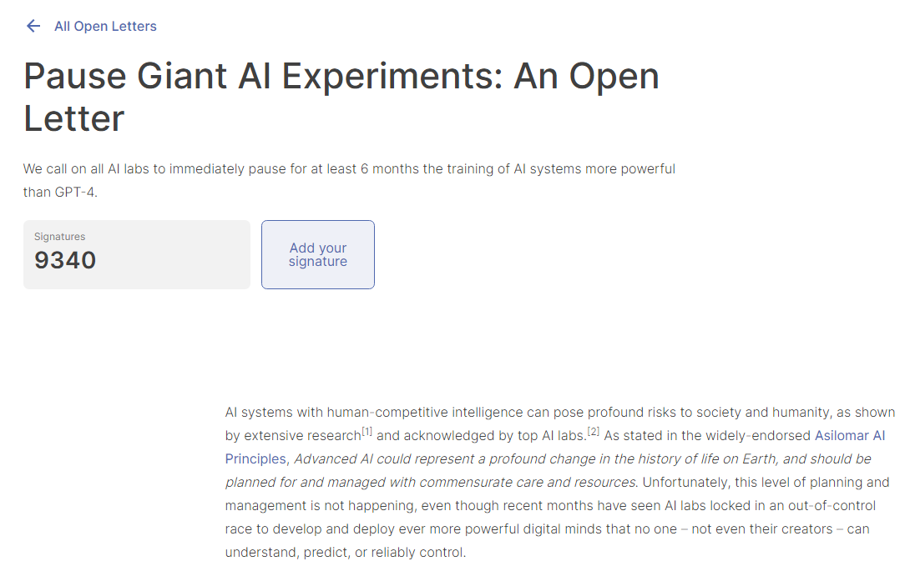
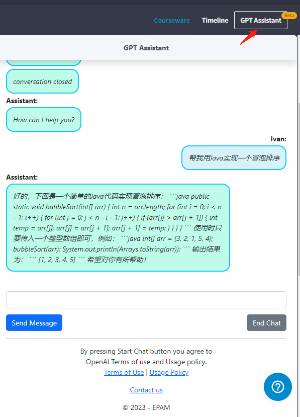
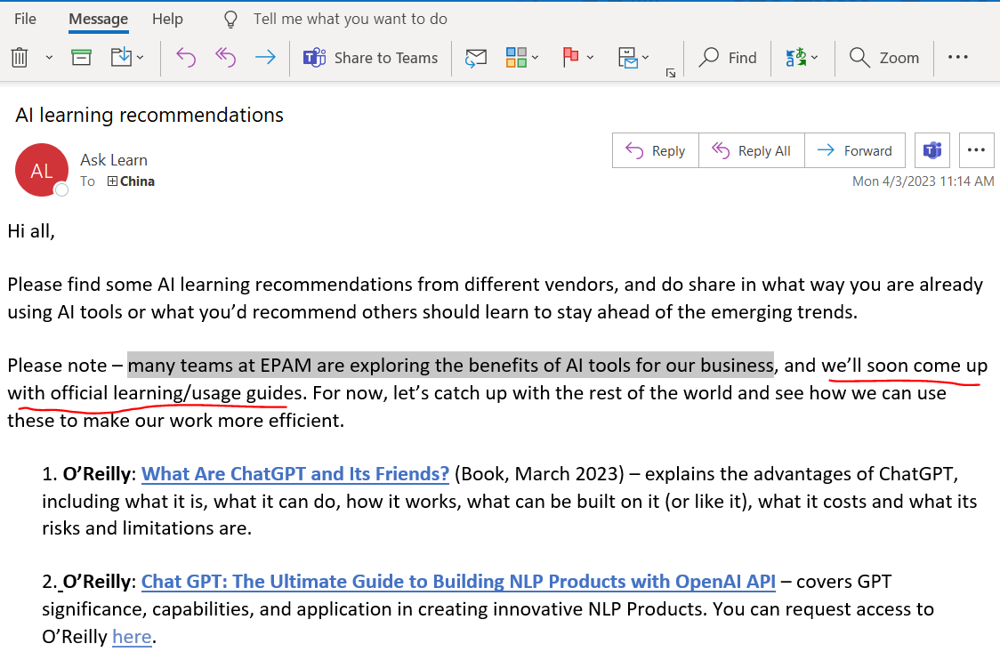

## <H1 style="color: #09c">Future of AI</H1 >
---

- 微软开源JARVIS，又称大模型和他的朋友们
- Solving AI Tasks with ChatGPT and its Friends in HuggingFace
- 利用ChatGPT分析需求自动调用其他模型拆分解决任务的程序。

- https://github.com/microsoft/JARVIS

---
基本模型的进展与相关应用的发展进程时间表

https://www.sequoiacap.cn/en/article/generative-ai-a-creative-new-world/

---
# What is GPT-4 and Why Does it Matter?
https://openai.com/research/gpt-4
### What is funny about this image? Describe it panel by panel.
 

---

### Answer question. Think step-by-step.

 

---
### 20 jobs that Chat GPT 4 will replace in the near future . Predicted by the AI itself .
    In a Markdown table what are 10 jobs that can't be taken by Al and why

### AI can't replace Jobs

---
### Pause Giant AI Experiments: An Open Letter（暂停大型人工智能实验: 一封公开信）
 - We call on all AI labs to immediately pause for at least 6 months the training of AI systems more powerful than GPT-4.

- 我们呼吁所有人工智能实验室立即暂停至少6个月的培训比 GPT-4更强大的人工智能系统。

- https://futureoflife.org/open-letter/pause-giant-ai-experiments/

---

# <H1 style="color: #056de8">EPAM's Steps</h1>
- Learn Portal - [GPT Assistant] 

https://learn.epam.com/study/path?rootId=3913892

# 

<H1 style="color: #f9c">AI不会取代你的工作,</H1>
<H1 style="color: #394">AI won't take your job, </H1>
<H1 style="color: #f9c">但用AI的人会</H1>
<H1 style="color: #394">but the one who use it will</H1>

